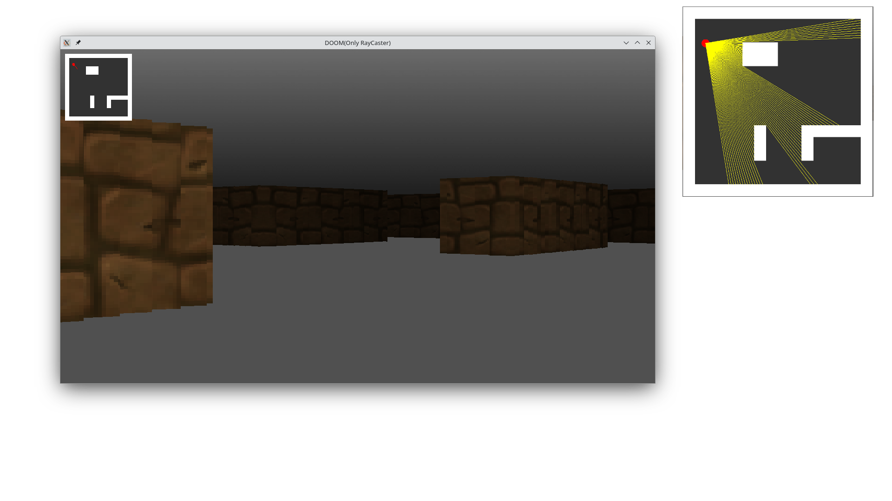

# RayCaster
A Wolfstein3D-style Raycasting implementation with C++ and SFML

 

---

## Dependencies
+ [C++ compiler](https://gcc.gnu.org/)
+ [SFML](https://www.sfml-dev.org/)
+ [Terlang](http://github.com/terroo/terlang)(Optional)

---

## Building
```bash
git clone http://github.com/terroo/raycaster
cd raycaster
ter build.ter
# Or: g++ -Ofast *.cpp -lsfml-graphics -lsfml-window -lsfml-system
```

---

## Details
The step-by-step development from scratch of this code was shown in [this video](https://youtu.be/2JDzJoEscr0): <https://youtu.be/2JDzJoEscr0>.

---
